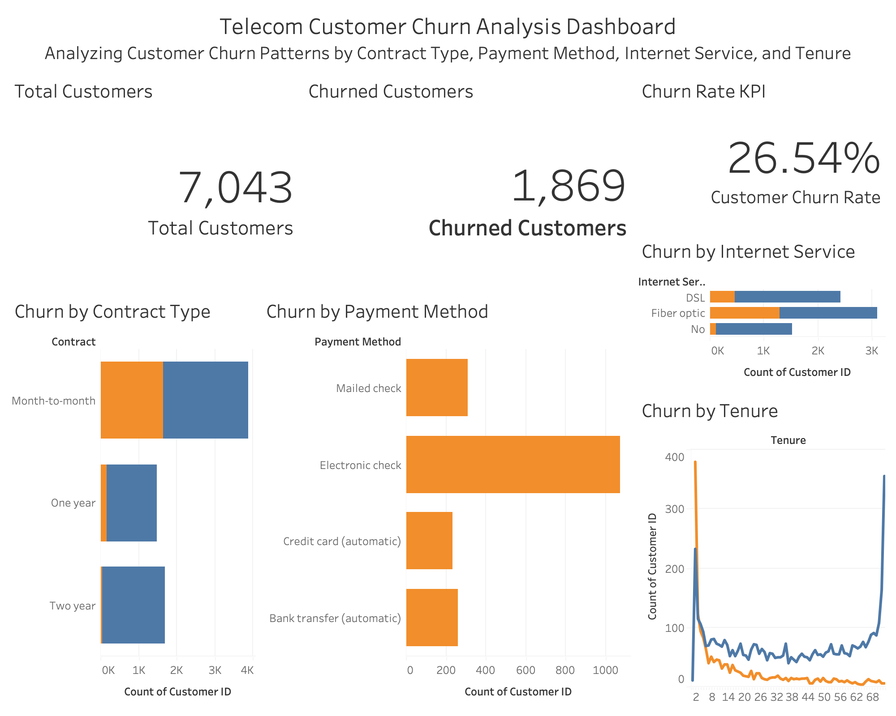

# 📊 Telecom Customer Churn Analysis

## 📌 Project Overview

Customer churn is a critical challenge for telecom companies as customer loss directly impacts revenue and profitability. This project analyzes customer demographics, service subscriptions, contract types, billing information, and payment methods to identify the key factors contributing to customer churn.

Using SQL for data analysis and Tableau for data visualization, this project provides actionable business insights that can help telecom companies improve customer retention and reduce churn.

---

## 🎯 Business Problem

Customer retention is often more cost-effective than acquiring new customers. The goal of this project is to:

- Analyze customer churn behavior
- Identify high-risk customer segments
- Understand factors influencing churn
- Provide recommendations to improve customer retention

---

## 🛠️ Tools & Technologies

- SQL (MySQL)
- Tableau
- Excel
- GitHub

---

## 📂 Dataset

The dataset contains telecom customer information, including:

- Customer Demographics
- Contract Type
- Internet Service
- Payment Method
- Monthly Charges
- Total Charges
- Customer Tenure
- Churn Status

---

## 🔍 SQL Analysis

The following business questions were analyzed using SQL:

1. Total Customers
2. Total Churned Customers
3. Overall Churn Rate
4. Churn by Gender
5. Churn by Senior Citizen Status
6. Churn by Contract Type
7. Churn by Internet Service
8. Average Monthly Charges by Churn Status
9. Average Total Charges by Churn Status
10. Churn by Payment Method
11. Churn by Paperless Billing
12. Customers with Highest Monthly Charges
13. Average Tenure by Churn Status
14. Churn by Multiple Lines Service
15. High-Risk Customer Segment Analysis

---

## 📈 Tableau Dashboard

The interactive Tableau dashboard provides:

### Key Performance Indicators (KPIs)

- Total Customers
- Churned Customers
- Churn Rate
- Average Monthly Charges

### Dashboard Insights

- Churn by Contract Type
- Churn by Internet Service
- Churn by Payment Method
- Customer Demographics
- Revenue Analysis
- Customer Tenure Analysis

---

## 📸 Dashboard Preview

### Main Dashboard

---

## 🔑 Key Findings

### 1. Month-to-Month Contracts Have the Highest Churn

Customers with month-to-month contracts are significantly more likely to leave compared to customers with long-term contracts.

### 2. New Customers Are More Likely to Churn

Customers with shorter tenure show higher churn rates than long-term customers.

### 3. Electronic Check Users Have Higher Churn

Customers using electronic check payments demonstrate greater churn compared to customers using automatic payment methods.

### 4. Higher Monthly Charges Increase Churn Risk

Customers paying higher monthly charges are more likely to discontinue services.

### 5. Fiber Optic Customers Show Elevated Churn

Fiber optic subscribers exhibit higher churn rates compared to DSL users.

---

## 💡 Business Recommendations

### Customer Retention Programs

Develop targeted retention campaigns for customers on month-to-month contracts.

### Loyalty Rewards

Provide incentives and discounts to customers with low tenure to encourage long-term retention.

### Contract Upgrade Promotions

Encourage customers to switch from month-to-month plans to annual or multi-year contracts.

### Billing Improvements

Promote automatic payment methods to improve customer engagement and retention.

### Proactive Churn Monitoring

Identify high-risk customers early and implement personalized retention strategies.

---

## 📊 Project Outcome

This analysis helps telecom businesses:

- Reduce customer churn
- Improve customer retention
- Increase customer lifetime value
- Support data-driven decision making
- Improve overall business profitability

---

## 👩‍💻 Author

**Nisha Bansari**

Aspiring Data Analyst

### Skills

- SQL
- Python
- Tableau
- Excel
- Data Visualization
- Business Analytics

### Connect With Me

📧 bansari.nisha20@gmail.com

🔗 LinkedIn: https://www.linkedin.com/in/nisha-bansari

---

⭐ If you found this project useful, feel free to star this repository and connect with me on LinkedIn.
